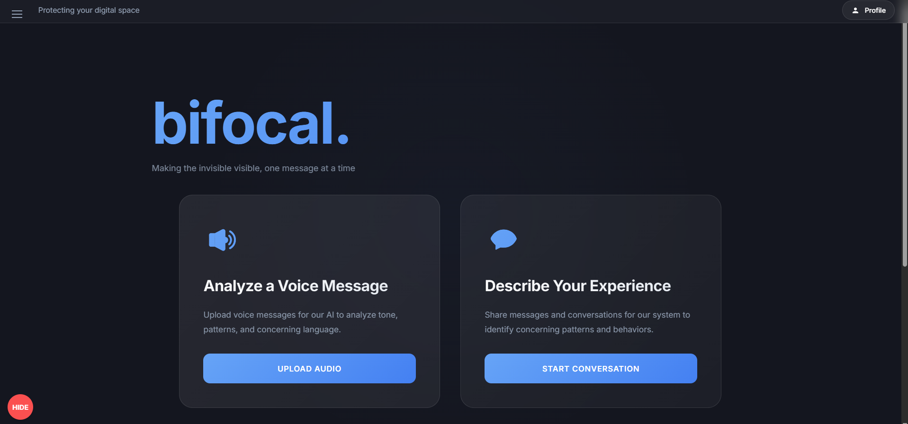
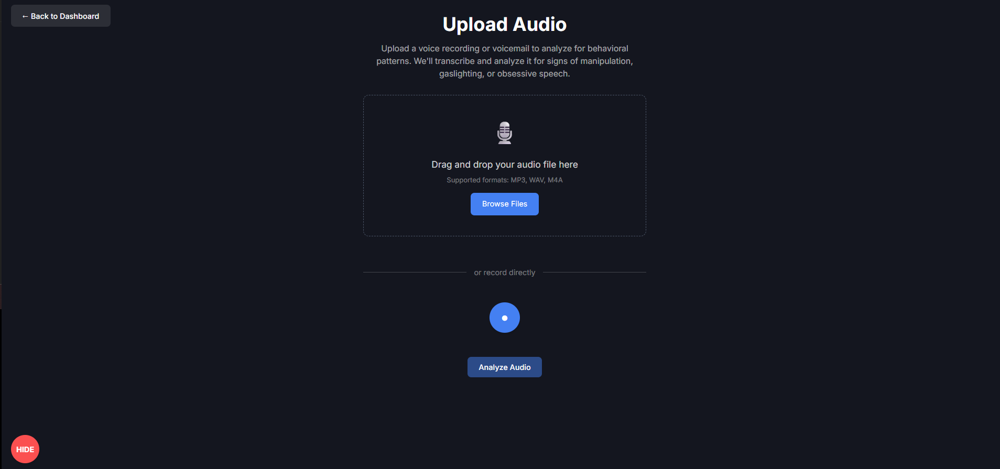
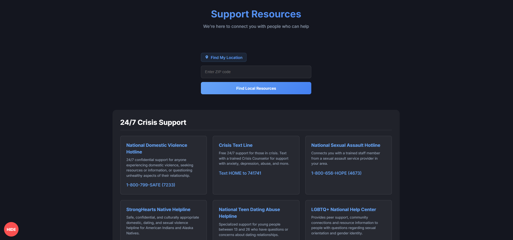
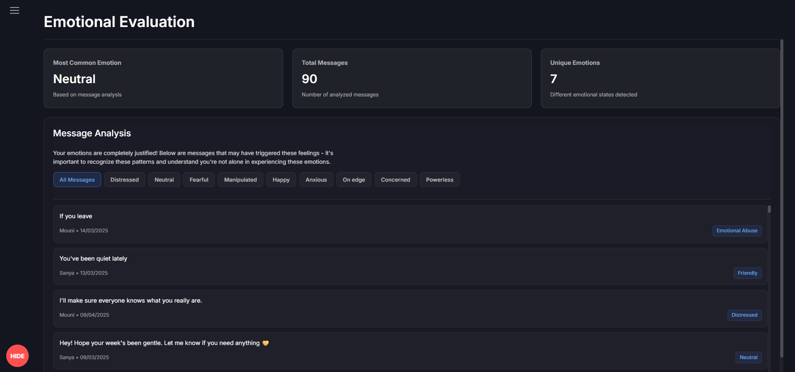

# 🧠 Bifocal – AI for Early Detection of Emotional & Psychological Abuse

## 💡 Inspiration

Domestic abuse and harassment often hide behind subtle messages—gaslighting, manipulation, and psychological control. Traditional tools fail to detect these patterns early, leaving individuals vulnerable and unsupported. **Bifocal** was created to fill this gap: a dual-lens AI platform that analyzes conversations from both the victim and offender perspectives, highlighting escalating risks through DSM-informed insights and empowering users with actionable support.

## 🚀 What It Does

**Bifocal** uses advanced AI and behavioral analysis to assess message history and flag potential risks, including:

* 🧠 **Victim Lens:** Detects trauma language, emotional distress, and psychological harm
* ⚠️ **Offender Lens:** Flags signs of coercive control, narcissism, and antisocial tendencies
* 💬 **Sentiment & Pattern Analysis:** Uses DSM-5-informed NLP to detect red flags and emotional shifts
* 🧍 **Personalized Guidance:** Offers resources, explanations, and steps tailored to the user’s needs
* 🗣️ **User Feedback Integration:** Allows users to highlight harmful messages for deeper analysis

## 🛠️ How We Built It

* **Frontend:** React + TypeScript + Emotion for a calming, responsive UI
* **NLP & ML:**

  * Sentiment analysis
  * Entity recognition
  * Linguistic + psychological pattern detection
  * Risk scoring and escalation modeling
  * Anomaly detection for behavior shifts
* **Frameworks:**

  * **Retrieval-Augmented Generation (RAG)** with DSM-5 context modeling
  * **MCP (Model Context Protocol)** to securely access iMessage data
  * Clinical criteria mapped to psychological signals for high-fidelity analysis

## 🧩 Challenges We Faced

* **Context Understanding:** Handling nuance in tone, slang, and emotional ambiguity across varied messages
* **Secure Data Access:** Establishing private, ethical access to iMessage logs with strong privacy protocols

## ✅ Accomplishments

* Developed a **dual-lens model** that evaluates both victim and offender behaviors
* Created a **clean, approachable UI** for communicating complex psychological insights
* Achieved **high pattern detection accuracy** validated against DSM-5 criteria

## 📚 What We Learned

This project deepened our knowledge of:

* Behavioral psychology and emotional abuse detection
* NLP use in high-sensitivity domains
* Frontend empathy-driven design for users navigating trauma
* Secure, ethical handling of sensitive conversation data

## 🔮 What’s Next for Bifocal

* 📱 Launching a mobile app for broader reach
* 🌐 Integrating platforms like WhatsApp and social media
* 🧠 Enhancing message context recognition (friend vs. stranger tone)
* 🕒 Adding daily emotional check-ins to monitor user well-being

## 🖼️ Screenshots

  

  

  

  

## 🛠️ Built With

* **AI & ML:** `huggingface`, `bert`, `RAG`, `machine-learning`, `python`
* **Frontend:** `react`, `typescript`, `css`, `html`, `emotion`, `javascript`
* **Speech & NLP:** `google-web-speech-api`, `natural-language-processing`
* **Infrastructure:** `sql`, `mcp`

---

## 📬 Contact

* GitHub: [@SecretariatV](https://github.com/SecretariatV)
* Email: [oliver.b25.f@gmail.com](mailto:oliver.b25.f@gmail.com)
* Telegram: [@ares\_orb](https://t.me/ares_orb)
* Twitter (X): [@OVB\_Coder](https://x.com/OVB_Coder)

